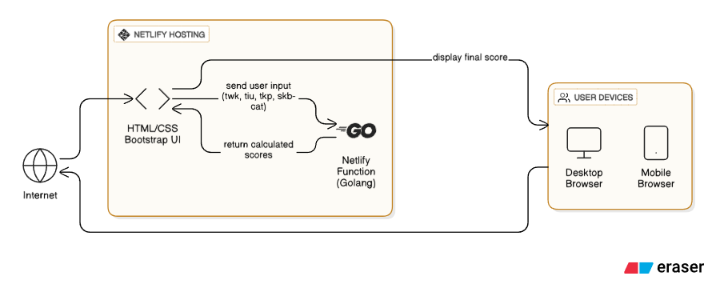

## High-Level Architecture V1
# Arsitektur Website CAT CPNS Score Generator

## **Overview**
Aplikasi ini menghitung nilai SKD (Seleksi Kompetensi Dasar) dan SKB (Seleksi Kompetensi Bidang) untuk ujian CPNS berdasarkan input pengguna, kemudian menampilkan hasilnya melalui antarmuka web.

---

## **Diagram Arsitektur**


---

## **Komponen Utama**

### 1. **Frontend (HTML/CSS + Bootstrap)**
- **Fungsi**: 
  - Menampilkan form input nilai (TWK, TIU, TKP, SKB)
  - Menunjukkan hasil perhitungan
- **Teknologi**:
  - HTML5, CSS3
  - Bootstrap untuk tampilan responsif
- **Hosting**: Netlify

### 2. **Backend (Netlify Function - Golang)**
- **Fungsi**:
  - Menerima input dari frontend
  - Menghitung nilai akhir menggunakan rumus penilaian ujian CPNS
  - Mengembalikan hasil ke frontend
- **Teknologi**:
  - Golang (Go)
  - Hosting: Netlify Functions

### 3. **Alur Data**
1. Pengguna memasukkan nilai melalui form di browser.
2. Frontend mengirim data ke Netlify Function (API).
3. Fungsi Golang memproses perhitungan:
   ```go
   Nilai SKD = (TWK + TIU + TKP) / 550 * 40%
   Nilai SKB = SKB / 500 * 60%
   Nilai Akhir = Nilai SKD + Nilai SKB